---
{"dg-publish":true,"permalink":"/chapter-i-basic-concepts-of-cibersecurity/","tags":["Linux","Cibersecurity"]}
---

## Basic concepts. Networks

### What is a network?

In a simple way, a network is an space where two or more devices interact among them. They set their own rules to transfer information

>A computer network involves connecting two or more computer devices (e.g., desktop computers, laptops, cell phones, routers, applications) to enable the transmission and exchange of information and resources.
>(IBM)

To make a network, also we need a means of data transmission, like a Ethernet wire or WiFi.

First we are simulating two cables

```mermaid
graph LR
	a("🖥️")<-->b("🖥️")
```

It is easy, and we have our first network, but if do we have three? Well, we have to connect the three computers among them, and each computer needs two Ethernet interfaces

```mermaid
graph LR
	a("🖥️")<-->b("🖥️")<-->c("🖥️")
	c<-->a
```

They must pact a common language of communication, between 1 and 2 there is a common language of communication, between 2 and 3 there is another and between 3 and 1 there is another.

Now If do we have more?

```mermaid
graph LR
	a("🖥️")
	b("🖥️")
	c("🖥️")
	i("🖥️")
	
	a<-->b
	a<-->c
	a<-->i
	
	b<-->c
	b<-->i
	
	c<-->i
	
	n("...")
```

It will be a difficult task to do. To make this easier, OSI model was created. It is a bunch of layers that represents the way that each device must communicate

>[!QUOTE] **References**
>[IBM. What is a computer network?](https://www.ibm.com/mx-es/think/topics/networking)
>