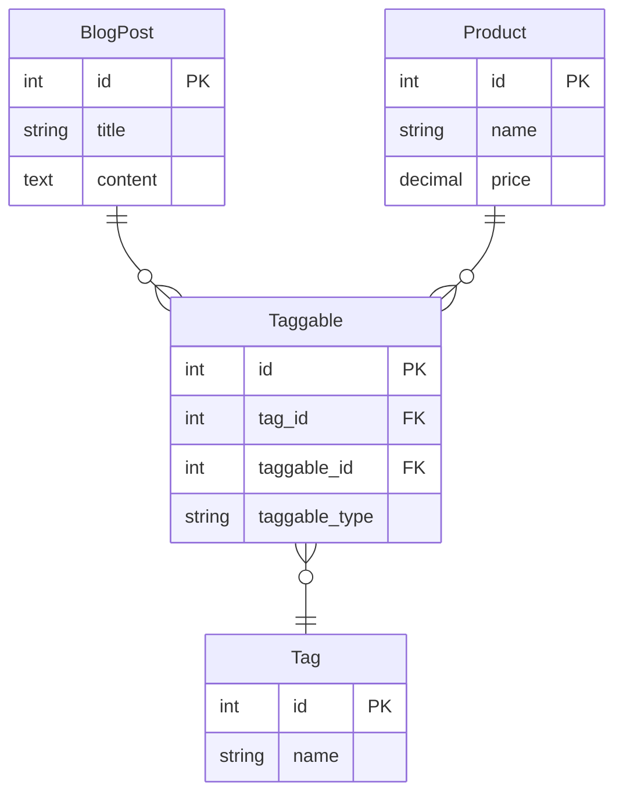

---
{"dg-publish":true,"permalink":"/learning/code/laravel/notes/polymorphic-relationships/"}
---

Polymorphic relationships refers to those elements in a database which could be related with more than one entity in the same relationship. This is possible when two or more entities can be related with other entities using just one middle table. In a regular relationship each one should have its corresponding middle table to relate with another entity.
## Type of relationships

### One to One

```mermaid
erDiagram
    %% ===================================
    %% UNO A UNO POLIMÓRFICA
     ===================================
    %% UNO A MUCHOS POLIMÓRFICA
    %% ===================================
    
    Article ||--o{ Comment : "has"
    Video ||--o{ Comment : "has"
    
    Article {
        int id PK
        string title
        text body
    }
    
    Video {
        int id PK
        string title
        string url
    }
    
    Comment {
        int id PK
        text content
        int commentable_id FK
        string commentable_type
    }
```

### Many to Many

