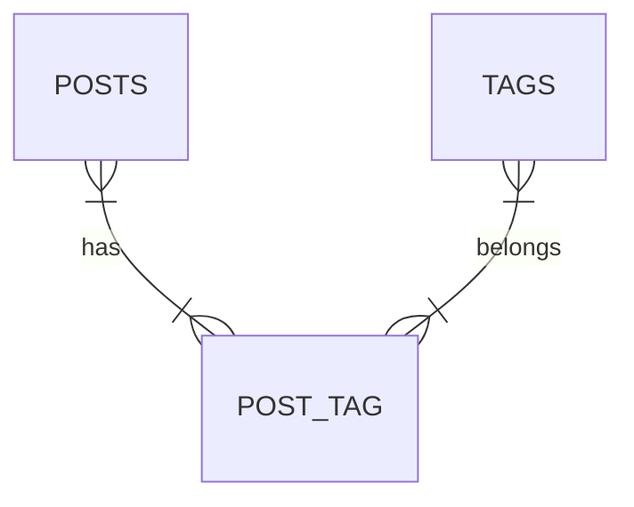

---
{"dg-publish":true,"permalink":"/learning/code/laravel/notes/relaciones-muchos-a-muchos/","tags":["DataBases","Eloquent"]}
---

#DataBases #controllers #Eloquent #models #Laravel 

# What are the many-to-many relationships

They are relationships among many entities between to classes. As it has to be, must be a *pivot* table, this table is going to set the relation between the two classes. Below is an example



In this example, **many posts could have many tags**, and **many tags could belong to many posts**. The pivot is called `post_tag`

>[!WARNING] Importnat Note
>As a recommendation, the pivot must be named as a combination of the names of the two classes **IN ORDER**. For this example, it must be `post_tag` not `tag_post` because like this is how eloquent knows how to execute the relationship

## Programming

First, we will create a migration using the next command

```powershell
php artisan make:migration create_post_tag_table
```

Inside this we will create the next code:

```php
public function up(): void
{
	Schema::create('post_tag', function (Blueprint $table) {
		$table->id();
		$table->foreignId('post_id')
				->constrained()
				->onDelete("cascade")
				->onUpdate("cascade");
		$table->foreignId('tag_id')
				->constrained()
				->onDelete("cascade")
				->onUpdate("cascade");
		$table->timestamps();
	});
}
```

- Inside of schema is:
	- Table id
	- Foreign id that is refering to posts table (foreign key)
	- Foreign id that isrefering to tags table (foreign key)
	- Timestamps

## Models configuration

Once we have created our migrations, we will see our models. It is necessary to configure the relationship. In this example the relation goes from posts to tags, so inside of the model `Post`:

```php
public function tags() {
	return $this->belongsToMany(Tag::class)
}
```

**In case that you do not follow the conventions, you have to specify:**

- The pivot table
- The two foreign keys in order

You can see this case below:

```php
public function tags() {
	return $this->belongsToMany(Tag::class, 'tagger', 'post', 'tag')
}
```

## Métodos de captura en los Modelos.

Para capturar la información, igual que las otras relaciones se deben hacer métodos para ello.

En el modelo ``Post``:

```php
public function tags()
{
	return $this->belongsToMany(Tag::class);
}
```

>[!NOTE] Nota
>Si por alguna razón, decides poner otro nombre a la tabla pivote, como Eloquent trabaja por convenciones de escritura, entonces se tendrás que definir manualmente, cual es la tabla pivote. por ejemplo, en lugar de usar la convención (para este ejemplo) *post_tag* se uso *tabla_pivote*
>```php
>public function tags()
>{
>	return $this->belongsToMany(Tag::class, "tabla_pivote");
>}
>```

En el modelo ``Tag``:

```php
public function posts()
{
	return $this->belongsToMany(Post::class);
}
```

# Creación de elementos relacionados.

Una vez ya hechas las instancias necesarias en nuestros modelos, se pueden crear registros relacionado a partir de un registro existente en la primera tabla, en este caso, si ya existe un ``Post`` y una serie de ``Tag``'s, por ejemplo, para asignar la relación se debe hacer lo siguiente

```php
Route::get('/test', function () {
	$post = Post::find(1);
	$post->tags()->attach([1,3]);// Aqui la seríe de registros que deseamos enlazar por medio del id
});
```

# Eliminar una relación

En caso de que ya no se desee tener una relación, por ejemplo, que del anterior caso se desee quitar el 3, entonces se hace lo siguiente: 

```php
Route::get('/test', function () {
	$post = Post::find(1);
	$post->tags()->detach([3]);
});
```

# Sincronización de las relaciones.

En caso de que, por ejemplo, ahora se busque poner todas las tags a un post (el de id 1, por ejemplo), si se usa ``attach()`` como método de relación, va a duplicar algún campo que no hayamos eliminado. Para evitar esto, se usa el método ``sync()``, que antes de agregar alguna relación, verifica que no exista en los registros, si ya existe, **omitirá agregar dicha relación**.

```php
Route::get('/test', function () {
	$post = Post::find(1);
	$post->tags()->sync([1,2,3])
});
```

No solamente agrega, sino que elimina, es una sincronización en sentido literal. Por ejemplo, si se quita el numero de id 2 de la sincronización, lo borrara en la base de datos:

```php
Route::get('/test', function () {
	$post = Post::find(1);
	$post->tags()->sync([1,3])
});
```